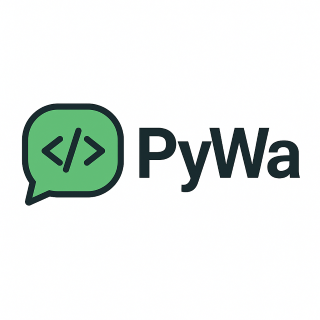

# Convertitore Chat WhatsApp in HTML



Uno strumento a riga di comando in Python che converte le esportazioni delle chat WhatsApp in file HTML formattati.

## Caratteristiche

- Converte le esportazioni delle chat WhatsApp (.txt) in formato HTML
- Mantiene la formattazione della chat e i timestamp
- Raggruppa i messaggi per data
- Supporta allineamenti diversi per i messaggi in base al mittente
- Gestisce correttamente i messaggi di sistema e le date in formato italiano

## Utilizzo

### Conversione della chat

1. Esporta la chat come file di testo da WhatsApp
2. Copia il file sul tuo computer
3. Esegui il seguente comando:

```bash
python whatsapp_to_html.py nome_chat.txt
```

Ti verrà chiesto di inserire il tuo nome per allineare correttamente i tuoi messaggi a destra.

Il file HTML verrà salvato come `nome_chat.html` nella stessa cartella del file di input.

### Esecuzione dei test

Il progetto include una suite di test per verificare il corretto funzionamento del codice. Per eseguire i test:

```bash
# Esegui tutti i test
python run_tests.py

# Oppure esegui un singolo file di test
python -m tests.test_parser
python -m tests.test_html_generator
```

I test verificano:
- Il corretto parsing dei messaggi
- La generazione dell'HTML
- La gestione dei casi particolari (messaggi lunghi, messaggi di sistema, ecc.)

## Requisiti

- Python 3.6 o superiore

## Licenza

Questo progetto è rilasciato sotto licenza GNU General Public License v3.0 - vedi il file [LICENSE](LICENSE) per i dettagli.
